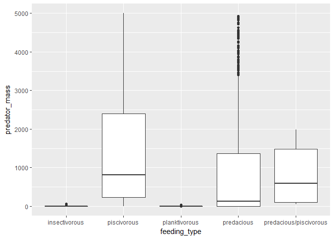
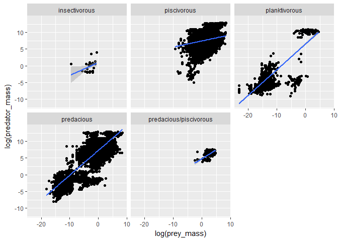

possible analysis
=================

-   biomass vs. lattitude: converge lattitude into number, try simple
    linear model
-   biomass/length vs. feeding behaviour: chi-square ?
-   predator-prey mass: furthur analysis on each species/ confidence
    interval
-   feeding behaviour vs. location/temp: bar chart?/pie chart?
-   biomass/length vs. depth: linear model

required pachage and modification on file
-----------------------------------------

    ## 
    ## Attaching package: 'dplyr'

    ## The following objects are masked from 'package:stats':
    ## 
    ##     filter, lag

    ## The following objects are masked from 'package:base':
    ## 
    ##     intersect, setdiff, setequal, union

    ## Parsed with column specification:
    ## cols(
    ##   .default = col_character(),
    ##   `Record number` = col_integer(),
    ##   `Individual ID` = col_integer(),
    ##   `Predator length` = col_double(),
    ##   `Predator standard length` = col_double(),
    ##   `Predator fork length` = col_double(),
    ##   `Predator total length` = col_double(),
    ##   `Standardised predator length` = col_double(),
    ##   `Predator quality of length-mass conversion` = col_integer(),
    ##   `Predator mass` = col_double(),
    ##   `Predator mass check` = col_double(),
    ##   `Predator mass check diff` = col_double(),
    ##   `Predator ratio mass/mass` = col_double(),
    ##   `SI predator mass` = col_double(),
    ##   `Prey length` = col_double(),
    ##   `Prey quality of conversion to length` = col_integer(),
    ##   `SI prey length` = col_double(),
    ##   `Prey mass` = col_double(),
    ##   `Prey mass check` = col_double(),
    ##   `Prey mass check diff` = col_double(),
    ##   `Prey ratio mass/mass` = col_double()
    ##   # ... with 7 more columns
    ## )

    ## See spec(...) for full column specifications.

possible figure
===============

-   figure 1:biomass vs. feeding type, box plot

-   figure 2:predator mass vs. prey mass in log scale, facet by feeding
    type with linear regression.

facet by taxon/species can also be added.

-   figure 3:predator mass vs. annual average temperature

Possible results tables
=======================

-frequency of each feeding tyoe/ location

    ## # A tibble: 5 x 2
    ##             feeding_type     n
    ##                    <chr> <int>
    ## 1          insectivorous    32
    ## 2            piscivorous 20775
    ## 3          planktivorous  1569
    ## 4             predacious 12394
    ## 5 predacious/piscivorous   161

    ## # A tibble: 25 x 2
    ##                                  geographic     n
    ##                                       <chr> <int>
    ##  1     Andaman Sea (West of South Thailand)    34
    ##  2                      Antarctic Peninsula  2229
    ##  3                Apalachicola Bay, Florida   173
    ##  4                           Atlantic Ocean 16084
    ##  5 Cape Cod Bay, Gulf of Maine, New England    88
    ##  6                              Catalan Sea   439
    ##  7            Crooked Island Sound, Florida   103
    ##  8                    Eastern Mediterranean   367
    ##  9             Europe, Celtic Sea ecosystem  2091
    ## 10                    French Polynesian EEZ  4011
    ## # ... with 15 more rows

    ## # A tibble: 16 x 2
    ##                            habitat     n
    ##                              <chr> <int>
    ##  1                     Coastal Bay   573
    ##  2      Coastal, SW & SE Greenland    49
    ##  3               demersal food web  2091
    ##  4                 estuary/coastal  1315
    ##  5 Euboikos and Pagassitikos Gulfs   367
    ##  6                         inshore    34
    ##  7                       nearshore   650
    ##  8                Nearshore waters    45
    ##  9       Off the continental Shelf  4412
    ## 10           offShelf and on Shelf   163
    ## 11                      open ocean  4011
    ## 12                         Pelagic 16084
    ## 13          Seasonal Pack Ice Zone  2229
    ## 14                           Shelf  2022
    ## 15           Shelfbreak/open ocean   439
    ## 16               transition region   447
