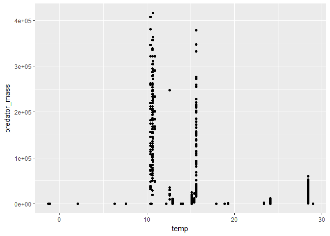

    library(ggplot2)
    library(dplyr)

    ## Warning: package 'dplyr' was built under R version 3.3.3

    ## 
    ## Attaching package: 'dplyr'

    ## The following objects are masked from 'package:stats':
    ## 
    ##     filter, lag

    ## The following objects are masked from 'package:base':
    ## 
    ##     intersect, setdiff, setequal, union

    marine2 <- plyr::rename(marine,c( "Type of feeding interaction" = "feeding_type", "Predator standard length" = "predator_standars_length", "Mean annual temp" = "temp", "Predator mass" = "predator_mass", "Prey mass" = "prey_mass","Predator  taxon" = "Predator_taxon","Geographic location" = "geographic", "Specific habitat"
                                      = "habitat"))
    marine2

    ## # A tibble: 34,931 x 60
    ##    `Record number` `In-ref ID` `Individual ID`                   Predator
    ##              <dbl>       <chr>           <dbl>                      <chr>
    ##  1               1     ATSH063               1 Rhizoprionodon terraenovae
    ##  2               2     ATSH080               2 Rhizoprionodon terraenovae
    ##  3               3     ATSH089               3 Rhizoprionodon terraenovae
    ##  4               4     ATSH143               4 Rhizoprionodon terraenovae
    ##  5               5     ATSH161               5 Rhizoprionodon terraenovae
    ##  6               6     ATSH166               6 Rhizoprionodon terraenovae
    ##  7               7     ATSH172               7 Rhizoprionodon terraenovae
    ##  8               8     ATSH192               8 Rhizoprionodon terraenovae
    ##  9               9     ATSH205               9 Rhizoprionodon terraenovae
    ## 10              10     ATSH205               9 Rhizoprionodon terraenovae
    ## # ... with 34,921 more rows, and 56 more variables: `Predator common
    ## #   name` <chr>, Predator_taxon <chr>, `Predator lifestage` <chr>,
    ## #   feeding_type <chr>, `Predator length` <dbl>, `Predator length
    ## #   unit` <chr>, `Predator dimension measured` <chr>,
    ## #   predator_standars_length <dbl>, `Predator fork length` <dbl>,
    ## #   `Predator total length` <dbl>, `Predator TL/FL/SL conversion
    ## #   reference` <chr>, `Standardised predator length` <dbl>, `Predator
    ## #   measurement type` <chr>, `Predator length-mass conversion
    ## #   method` <chr>, `Predator length-mass conversion reference` <chr>,
    ## #   `Predator quality of length-mass conversion` <dbl>,
    ## #   predator_mass <dbl>, `Predator mass unit` <chr>, `Predator mass
    ## #   check` <dbl>, `Predator mass check diff` <dbl>, `Predator ratio
    ## #   mass/mass` <dbl>, `SI predator mass` <dbl>, `Diet coverage` <chr>,
    ## #   Prey <chr>, `Prey common name` <chr>, `Prey taxon` <chr>, `Prey
    ## #   length` <dbl>, `Prey length unit` <chr>, `Prey conversion to length
    ## #   method` <chr>, `Prey quality of conversion to length` <dbl>, `Prey
    ## #   conversion to length reference` <chr>, `SI prey length` <dbl>, `Prey
    ## #   dimension measured` <chr>, `Prey width` <chr>, `Prey width
    ## #   unit` <chr>, `Prey measurement type` <chr>, prey_mass <dbl>, `Prey
    ## #   mass unit` <chr>, `Prey mass check` <dbl>, `Prey mass check
    ## #   diff` <dbl>, `Prey ratio mass/mass` <dbl>, `SI prey mass` <dbl>, `Prey
    ## #   conversion to mass method` <chr>, `Prey conversion to mass
    ## #   reference` <chr>, `Prey quality of conversion to mass` <dbl>,
    ## #   geographic <chr>, Latitude <chr>, Longitude <chr>, Depth <dbl>,
    ## #   temp <dbl>, `SD annual temp` <dbl>, `Mean PP` <dbl>, `SD PP` <dbl>,
    ## #   Reference <chr>, habitat <chr>, `Notes / assumptions` <chr>

    g <- ggplot(marine2, color = predator_taxon)
    g+
      geom_boxplot(aes(x = feeding_type, y = predator_mass))+
      ylim(0,5000)

    ## Warning: Removed 11279 rows containing non-finite values (stat_boxplot).

# Possible results figures

    g + 
      geom_point(aes(x = log(prey_mass), y = log(predator_mass)))+
      geom_smooth(aes(x = log(prey_mass), y = log(predator_mass)),method = "glm")+
     facet_wrap(~feeding_type)

    marine2 %>% 
      group_by(feeding_type) %>% 
      tally()

    ## # A tibble: 5 x 2
    ##             feeding_type     n
    ##                    <chr> <int>
    ## 1          insectivorous    32
    ## 2            piscivorous 20775
    ## 3          planktivorous  1569
    ## 4             predacious 12394
    ## 5 predacious/piscivorous   161

    g+
      geom_point(aes(x = temp, y = predator_mass))

# Possible results tables

    marine2 %>% 
      group_by(geographic) %>% 
      tally()

    ## # A tibble: 25 x 2
    ##                                  geographic     n
    ##                                       <chr> <int>
    ##  1     Andaman Sea (West of South Thailand)    34
    ##  2                      Antarctic Peninsula  2229
    ##  3                Apalachicola Bay, Florida   173
    ##  4                           Atlantic Ocean 16084
    ##  5 Cape Cod Bay, Gulf of Maine, New England    88
    ##  6                              Catalan Sea   439
    ##  7            Crooked Island Sound, Florida   103
    ##  8                    Eastern Mediterranean   367
    ##  9             Europe, Celtic Sea ecosystem  2091
    ## 10                    French Polynesian EEZ  4011
    ## # ... with 15 more rows

    marine2 %>% 
      # filter(habitat=='Coastal bay') %>% 
      mutate(habitat=gsub("Coastal bay", "Coastal Bay", habitat)) %>% 
      mutate(habitat=gsub("shelf", "Shelf", habitat)) %>%
       group_by(habitat) %>% 
       tally()

    ## Warning: package 'bindrcpp' was built under R version 3.3.3

    ## # A tibble: 16 x 2
    ##                            habitat     n
    ##                              <chr> <int>
    ##  1                     Coastal Bay   573
    ##  2      Coastal, SW & SE Greenland    49
    ##  3               demersal food web  2091
    ##  4                 estuary/coastal  1315
    ##  5 Euboikos and Pagassitikos Gulfs   367
    ##  6                         inshore    34
    ##  7                       nearshore   650
    ##  8                Nearshore waters    45
    ##  9       Off the continental Shelf  4412
    ## 10           offShelf and on Shelf   163
    ## 11                      open ocean  4011
    ## 12                         Pelagic 16084
    ## 13          Seasonal Pack Ice Zone  2229
    ## 14                           Shelf  2022
    ## 15           Shelfbreak/open ocean   439
    ## 16               transition region   447

# possible analysis

